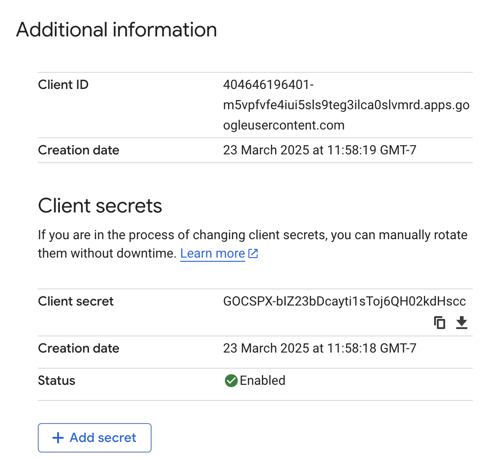

# Part 1: OAuth Integration and GitHub Widget

## Step 1: Enabling OAuth with Google

Set up Google OAuth 2.0 credentials in [Google Cloud Console](https://console.cloud.google.com):

- Created a new project and with a customized name.
- Click **Go to APIs overview** to enable **Google+ API** and **Contacts API**.
- Configure **OAuth consent screen**, generated a **Web application** credential with:
  - Authorized JavaScript origin: `https://portfolio.play.kaiwenx.xyz`
  - Redirect URI: `https://portfolio.play.kaiwenx.xyz/login/google/authorized`
- Saved the **Client ID** and **Client Secret** for use in the application.

**Google Cloud OAuth setup:**  


---

## Step 2: Implementing OAuth Login in the Portfolio

1. Installed required packages:

   - `flask`, `flask-session`, `flask-login`, and `flask-dance`.

2. Set up Flask session and login management:

   - Used `Flask-Session` with `SESSION_TYPE = "filesystem"` to persist sessions.
   - Used `Flask-Login` to track login state and protect access.

3. Created a `User` class with `UserMixin` and a `users_db` dictionary to store authenticated user data.

   - Defined `load_user()` function to support session restoration.

4. Configured Google OAuth using `Flask-Dance`:

   - Registered the Google OAuth blueprint with `make_google_blueprint()`.
   - OAuth callback (`/google-login`) fetches user info and stores the name in session.

5. Login flow:
   - If the user is authenticated via Google, user name will be displayed on the homepage.
   - Otherwise, the default "Login" is shown.

**Screenshot of login flow working in the browser:**

- Before Login
  
- After Login
  

## Step 3: Embedding GitHub Contributions Widget

To display GitHub activity on the portfolio site, the [GitHub Contributions Widget](https://github.com/imananoosheh/github-contributions-widget) was embedded using the public CDN.

1. **Include the widget script**  
   The following `<script>` was added before the closing `</body>` to load the widget:

```html
<script src="https://cdn.jsdelivr.net/npm/github-contributions-widget@latest"></script>
```

2. **Add the widget container**  
   The following custom HTML element was placed into a separate section with id='widget':

```html
<github-contributions username="kaiwenx99"></github-contributions>
```

3. **Change the appearance**  
   The widget appearance is changed to match the theme blue and green color.

4. **Verified functionality**  
   The widget successfully displayed a GitHub calendar of my contributions from the past year.

**Screenshot of embedded GitHub contributions widget:**  

